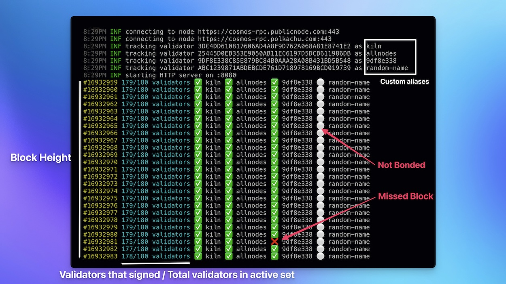

# Cosmos Validator Watcher

[](https://opensource.org/licenses/MIT)

**Cosmos Validator Watcher** is a Prometheus exporter to help you monitor missed blocks on
any cosmos-based blockchains in real-time.

- Tracks for each block how many validators missed the signatures
- Tracks the current active set and check which validator is **bonded** or **jailed**
- Export all metrics (eg. missed blocks) on the `/metrics` endpoint


## ✨ Usage

Example for cosmoshub using 2 public RPC nodes and tracking 4 validators (with custom aliases).



### Via compiled binary

Compiled binary can be found on the [Releases page](https://github.com/kilnfi/cosmos-validator-watcher/releases).

```bash
cosmos-validator-watcher \
  --node https://cosmos-rpc.publicnode.com:443 \
  --node https://cosmos-rpc.polkachu.com:443 \
  --validator 3DC4DD610817606AD4A8F9D762A068A81E8741E2:kiln \
  --validator 25445D0EB353E9050AB11EC6197D5DCB611986DB:allnodes \
  --validator 9DF8E338C85E879BC84B0AAA28A08B431BD5B548:9df8e338 \
  --validator ABC1239871ABDEBCDE761D718978169BCD019739:random-name
```

### Via Docker

Latest Docker image can be found on the [Packages page](https://github.com/kilnfi/cosmos-validator-watcher/pkgs/container/cosmos-validator-watcher).

```bash
docker run --rm ghcr.io/kilnfi/cosmos-validator-watcher:latest \
  --node https://cosmos-rpc.publicnode.com:443 \
  --node https://cosmos-rpc.polkachu.com:443 \
  --validator 3DC4DD610817606AD4A8F9D762A068A81E8741E2:kiln \
  --validator 25445D0EB353E9050AB11EC6197D5DCB611986DB:allnodes \
  --validator 9DF8E338C85E879BC84B0AAA28A08B431BD5B548:9df8e338 \
  --validator ABC1239871ABDEBCDE761D718978169BCD019739:random-name
```

### Available options

```
cosmos-validator-watcher --help

NAME:
   cosmos-validator-watcher - Real-time Cosmos-based chains monitoring tool

USAGE:
   cosmos-validator-watcher [global options] command [command options] [arguments...]

COMMANDS:
   help, h  Shows a list of commands or help for one command

GLOBAL OPTIONS:
   --http-addr value                        http server address (default: ":8080")
   --namespace value                        namespace for Prometheus metrics (default: "cosmos_validator_watcher")
   --no-color                               disable colored output (default: false)
   --node value [ --node value ]            RPC node endpoint to connect to (speficied multiple nodes for high availability) (default: "http://localhost:26657")
   --validator value [ --validator value ]  validator address(es) to track (use :my-label to add a custom label in metrics & ouput)
   --help, -h                               show help
   --version, -v                            print the version
```


## ❇️ Endpoints

- `/metrics` exposed Prometheus metrics (see next section)
- `/ready` responds OK when at least one of the nodes is synced (ie. `.SyncInfo.catching_up` is `false`)
- `/live` responds OK as soon as server is up & running correctly


## 📊 Prometheus metrics

All metrics are by default prefixed by `cosmos_validator_watcher` but this can be changed through options.

Metrics (without prefix) | Description
----------------------------------------------|------------------------------------------------
`block_height`           | Latest known block height (all nodes mixed up)
`validated_blocks`       | Number of validated blocks per validator (for a bonded validator)
`missed_blocks`          | Number of missed blocks per validator (for a bonded validator)
`tracked_blocks`         | Number of blocks tracked since start
`skipped_blocks`         | Number of blocks skipped (ie. not tracked) since start
`bonded_tokens`          | Number of bonded tokens per validator
`is_bonded`              | Set to 1 if the validator is bonded
`is_jail`                | Set to 1 if the validator is jailed
`node_block_height`      | Latest fetched block height for each node
`node_synced`            | Set to 1 is the node is synced (ie. not catching-up)


## ➡️ Flow

The app is structured in 2 parts:

- `watcher` connects to a Cosmos-based RPC node and watches for new blocks and the active validator set. You can use as many watchers as you want to ensure resilience and avoid missing any blocks.
- `exporter` receives data from all watchers, exposes Prometheus metrics, and writes status to standard output.


## ❓FAQ

### Which blockchains are compatible?

Any blockchains based on the cosmos-sdk should work:

- cosmoshub
- osmosis
- injective
- evmos
- persistence
- ...

This app is using the [CometBFT library](https://github.com/cometbft/cometbft/) (successor of Tendermint) as well as the `x/staking` module from the [Cosmos-SDK](https://github.com/cosmos/cosmos-sdk).

### How to get your validator pubkey address?

Use `tendermint show-validator` to get the pubkey and `debug pubkey` to convert to hex format.

```bash
gaiad debug pubkey "$(gaiad tendermint show-validator)" 2>&1 | grep "Address:" | awk '{print $2}'
```

(replace `gaiad` by the binary name or the desired chain, eg. `evmosd`, `strided`, `injectived`, …).


## 📃 License

[MIT License](LICENSE).
